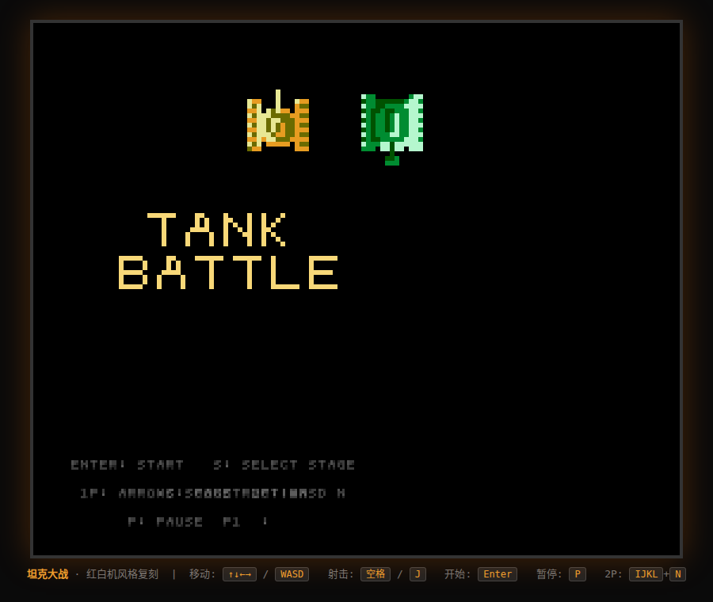
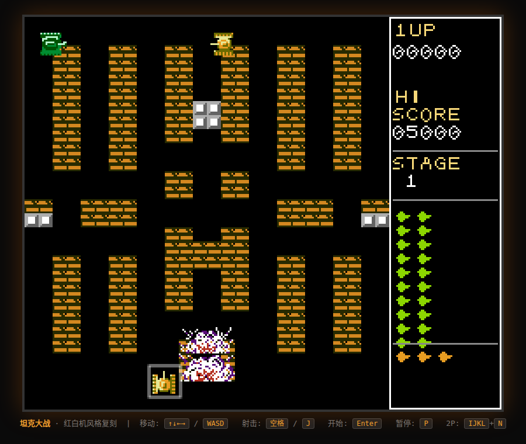
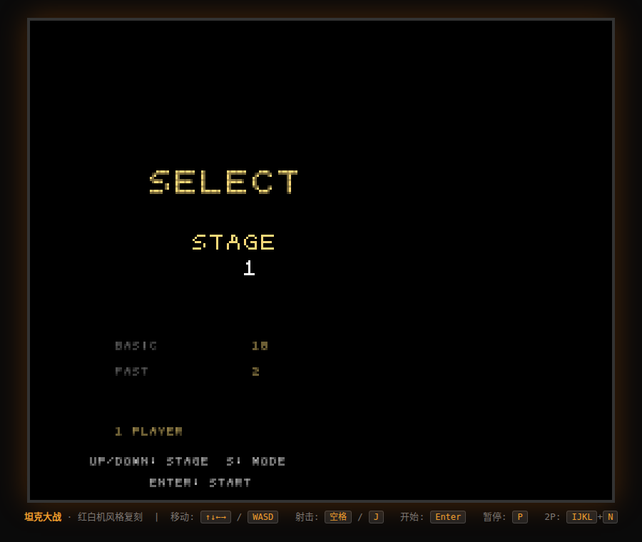
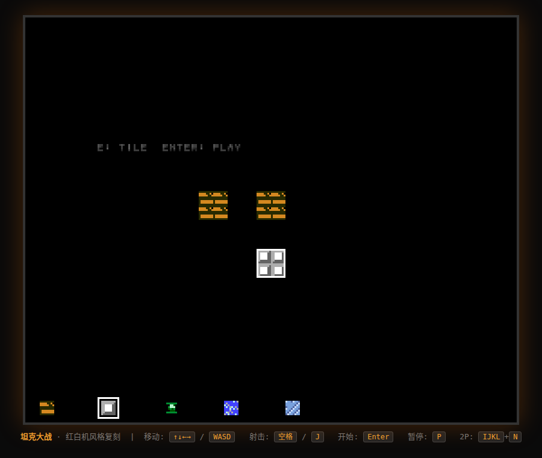

# 🎮 坦克大战（Battle City）— HTML5 像素级复刻

红白机《坦克大战》(Battle City, 1985 Namco) 的网页复刻版。单文件 HTML5 + Canvas，像素级还原原版观感与玩法。






## 运行方式

直接用浏览器打开 `index.html` 即可（无需服务器）。

## 操作

| 功能 | 1P | 2P |
|---|---|---|
| 移动 | ↑↓←→ / WASD | IJKL |
| 射击 | 空格 / J | N |
| 开始 / 确定 | Enter | |
| 选关 | 标题页按 S，↑↓ 选关 | |
| 施工模式 | 标题页按 C，E 切换图块 | |
| 暂停 | P | |

## 特性（对齐原版）

- **13×13 战场**（208×208 像素）+ 右侧 64px HUD（1UP/2UP、HI-SCORE、STAGE、剩余敌人数、生命）
- **35 个关卡**：地图与敌人配置取自原版 ROM 数据（26×26 半格精度，含半砖/半钢图块）
- **4 种敌坦克**：普通(绿/100分)、快速(灰/200分)、重型(红/300分，可击穿钢)、装甲(白/400分，4 血)
- **6 种道具**：星星(升级)、坦克(加命)、炸弹(全屏)、定时(冻结)、铲子(基地钢化)、头盔(无敌) —— 击杀闪烁敌人掉落
- **原版机制**：闪烁敌人(剩余17/10/3)、2万分加命、子弹互撞抵消、水/树/冰地形规则、出生星星动画、基地被毁即结束
- **原版 AI**：阶段化目标（追基地→随机→追玩家）、50%直行/25%左转/25%右转、被挡 25% 掉头、8px 对齐决策
- **施工模式**：自定义地图并游玩
- **芯片音效**（WebAudio）：射击/爆炸/撞钢/道具/引擎声/过关/结束 + 背景进行曲
- **2P 双人**同屏

## 文件

- `index.html` — 游戏本体（全部代码）
- `sprites.js` — 精灵像素数据（从原版素材提取）
- `stages.js` — 35 关地图与敌人数据
- `tools/` — 素材提取、构建与自动化测试脚本
- `test-report-*.md` — 各版本测试结论

## 测试

```bash
cd tools && node fulltest.js     # 功能/渲染测试
node flowtest.js                 # 流程测试（道具、通关、暂停）
node autoplay.js                 # AI 机器人自动试玩
```
